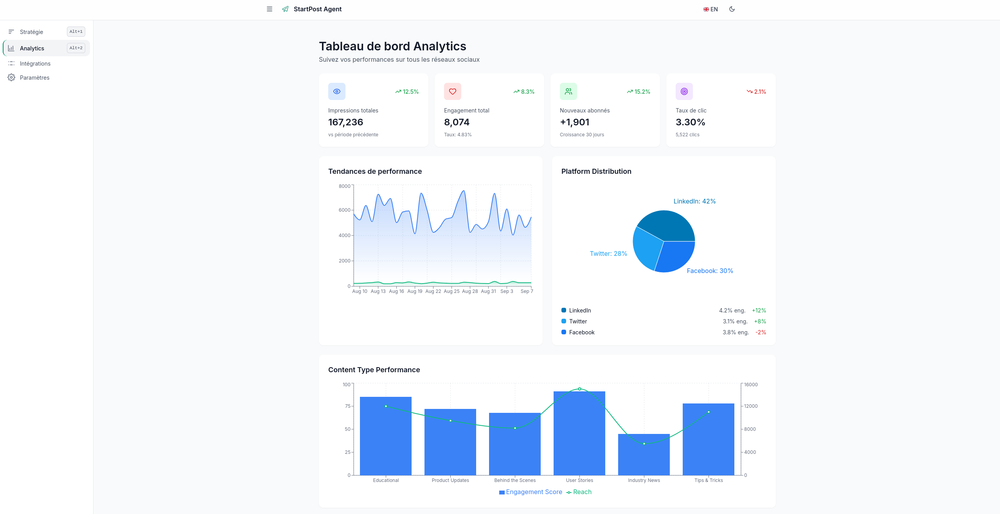
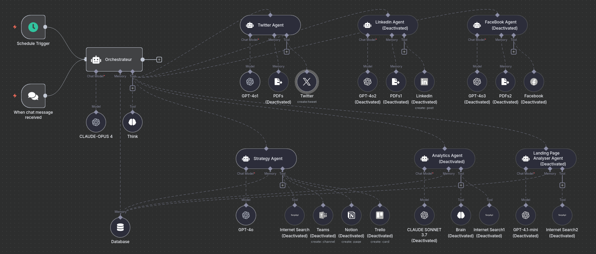

# StartPost Agent - Assistant IA Social Media

## 🚀 Description

StartPost Agent est une plateforme SaaS qui utilise des **agents IA intelligents** pour aider les PME à créer et optimiser leur stratégie de contenu social media. L'IA analyse automatiquement votre marque, génère du contenu personnalisé et optimise vos publications pour maximiser l'engagement.

### ✨ Fonctionnalités Clés
- **Analyse IA** automatique de votre site web et marque
- **Génération de contenu** personnalisé par IA
- **Optimisation** des posts pour chaque plateforme
- **Calendrier éditorial** intelligent
- **Analytics** en temps réel



## 🛠️ Technologies

- **Frontend**: React 19 + TypeScript + Vite + Tailwind CSS
- **Backend**: FastAPI + Python
- **IA**: Intégration BLACKBOX AI pour génération de contenu
- **Base de données**: SQLite (développement) / PostgreSQL (production)

## 🚀 Installation & Lancement

### Prérequis
- Docker
- Git

### Installation Rapide

```bash
# 1. Cloner le repository
git clone <repository-url>

# 4. Lancement de l'app
./start.sh
```

### Accès
- **Application**: http://localhost:3001
- **API Backend**: http://localhost:8000

## 🤖 Agents IA

Le projet utilise plusieurs agents IA spécialisés qui travaillent ensemble pour créer une stratégie de contenu complète :



### Agent d'Analyse
- Analyse automatique des sites web
- Extraction des valeurs de marque
- Identification de l'audience cible

### Agent de Contenu
- Génération de posts optimisés
- Adaptation du ton selon la plateforme
- Optimisation SEO et engagement

### Agent Stratégie
- Création de calendriers éditoriaux
- Recommandations de fréquence de publication
- Analyse des meilleures pratiques

## 📊 Utilisation

1. **Configuration initiale** : Analysez votre site web
2. **Génération IA** : Laissez les agents créer votre stratégie
3. **Personnalisation** : Ajustez le contenu selon vos préférences
4. **Publication** : Planifiez et publiez automatiquement

## 🔗 Liens utiles

- **Démo Twitter**: [https://x.com/HackathonB844](https://x.com/HackathonB844)

## 📄 Licence

MIT
